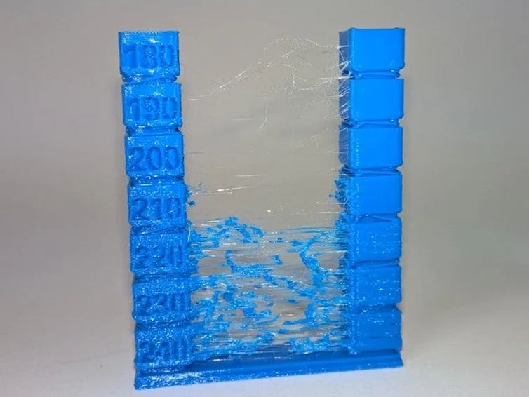
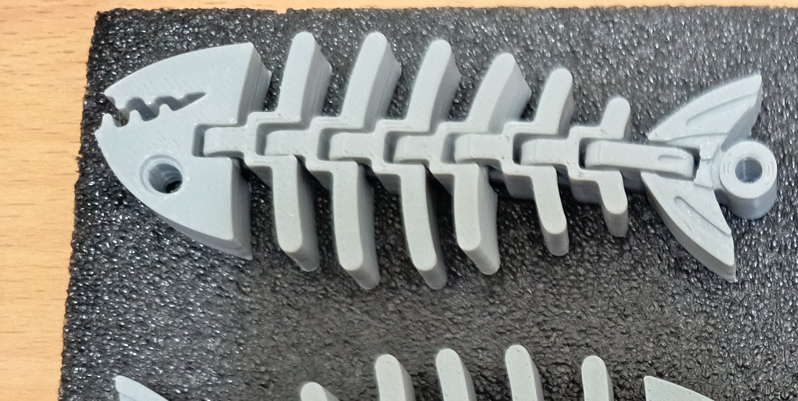
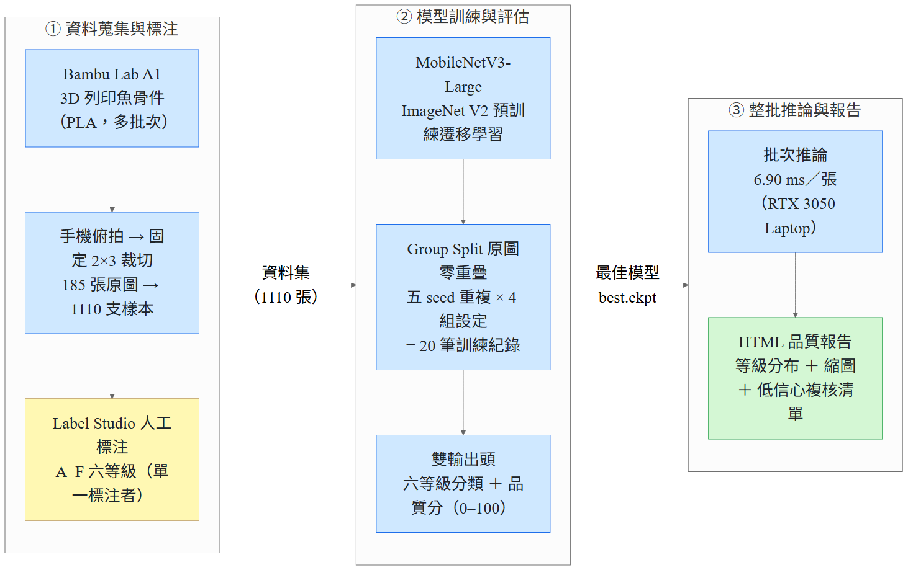
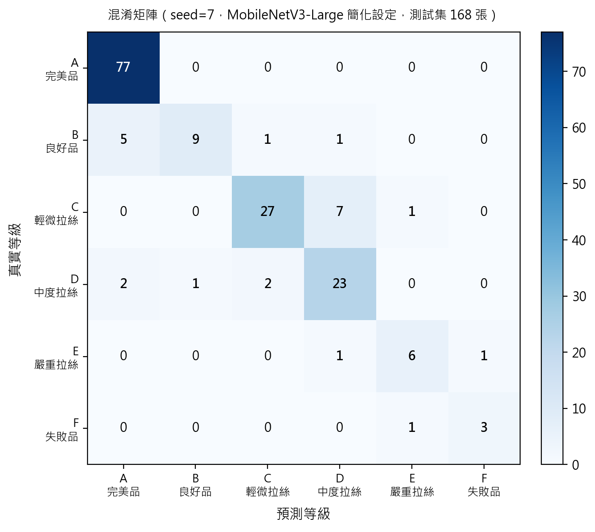
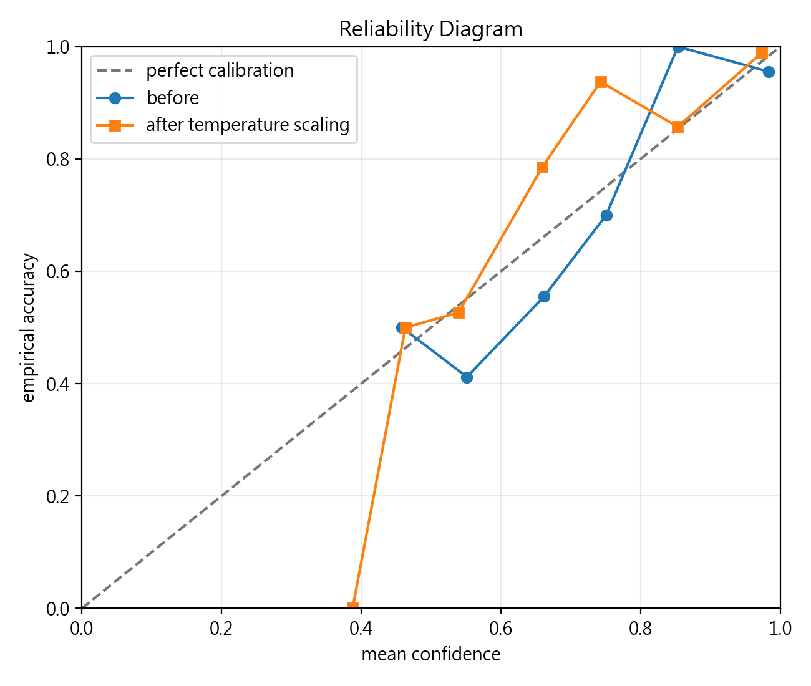
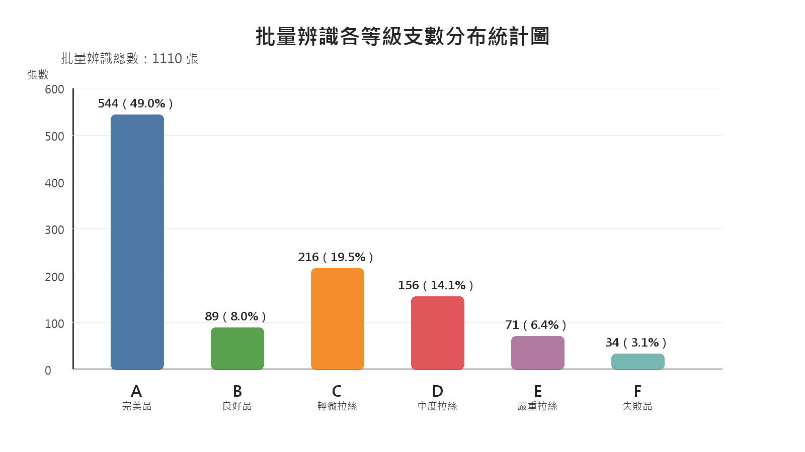

<!-- _class: lead -->

# 3D 列印件瑕疵檢測與品質評分研究設計

## Defect Detection and Quality Grading System for 3D-Printed Parts

**執行學生**：劉哲銘　·　**指導教授**：張致文 老師

國立聯合大學機械工程學系　·　中華民國 115 年

NSTC 114-2813-C-239-054-E

---

# 大綱

1. **研究背景與動機**：FDM 拉絲瑕疵的品管挑戰
2. **資料集建立**：魚骨件 1110 張、六等級標注
3. **研究方法**：MobileNetV3 遷移學習 + Group Split
4. **實驗結果**：五 seed 效能統計與瓶頸分析
5. **整批自動化流程**：照片到 HTML 品質報告
6. **結論與未來工作**

---

# 研究背景：FDM 拉絲瑕疵

**品質管控的困境**

- 人工目視耗時、標準因人而異
- **拉絲（Stringing）**：噴嘴空移時殘留細絲
- 嚴重程度受多參數交互影響，難以量化

**研究目標**

- 建立拉絲嚴重程度自動辨識的輔助工具
- 以嚴格評估協定驗證深度學習可行性

---

# 核心貢獻

本研究提供四項在特定條件下的成果：

1. **六等級分類資料集**：1110 張、原圖層級 Group Split
2. **嚴格可重現評估協定**：五 seed 重複 + 多數類別基準對照
3. **模型比較與消融分析**：MobileNetV3 / ResNet18 / EfficientNet-B0
4. **整批自動化流程原型**：照片 → 品質分級 HTML 報告

> **研究定位**：單一機型、單一材料、單一形狀、拉絲一種瑕疵的內部基準，定位為品質管控**輔助工具**，非可獨立判定的自動分級系統。

---

# 資料集建立

**為什麼選魚骨試片？**

- 細長肋條間隙對拉絲特別敏感
- 固定幾何，裁切邊界規則
- 黑色熱床背景對比明確

**資料規模**

- Bambu Lab A1 + PLA
- 8 批次、185 張原始照片
- 固定 2×3 網格自動裁切
- → **1110 支有效樣本**

---

<!-- _class: compact -->

# 六等級品質定義

| 等級 | 名稱 | 拉絲判斷標準 | 目標分 |
|------|------|------------|-------|
| **A** | 完美品 | 完全無拉絲 | 100 |
| **B** | 良好品 | 1-2 根極短細絲 | 80 |
| **C** | 輕微拉絲 | 覆蓋 < 1/4 魚身 | 60 |
| **D** | 中度拉絲 | 覆蓋 1/4 至 1/2 | 40 |
| **E** | 嚴重拉絲 | 覆蓋 > 1/2 魚身 | 20 |
| **F** | 失敗品 | 結構幾乎難辨識 | 0 |

> 全部 1110 張由**單一標注者**完成，多人一致性（Cohen's Kappa）尚待驗證。
> 所有 accuracy 反映「模型複製一人判斷」的能力，而非辨識客觀品質。

---

# 研究架構與資料流

---

<!-- _class: compact -->

# 評估設計：Group Split + 五 seed

**Group Split（原圖零重疊）**

- 以原圖 ID 分組，同源樣本不跨集
- 切分比例近似 70 / 15 / 15
- 防止資料洩漏，避免過度樂觀評估

**五 seed 重複實驗**

- Seed：7, 42, 123, 1234, 2024
- 4 組設定 × 5 seed = **20 筆紀錄**
- 報告 mean ± std，說明效力限制

**四組比較設定**

| 模型 | 策略 |
|------|------|
| MobileNetV3-Large | 簡化（CE） |
| MobileNetV3-Large | 完整（Focal+LS） |
| ResNet18 | 完整 |
| EfficientNet-B0 | 完整 |

**多數類別基準**：恆預測 A 等級 ≈ **49.2%**

---

<!-- _class: compact -->

# 實驗結果：五 seed 效能比較

| 模型 / 設定 | Accuracy | Macro-F1 | QWK | Acc std |
|------------|----------|----------|-----|---------|
| MobileNetV3 **簡化** | **81.19%** | 0.661 | 0.921 | 3.71% |
| MobileNetV3 **完整** | 80.12% | **0.713** | 0.909 | **5.98%** |
| ResNet18 完整 | 80.83% | 0.712 | 0.914 | 2.16% |
| EfficientNet-B0 完整 | **81.19%** | 0.698 | 0.910 | 2.25% |
| **多數類別基準** | ≈49.2% | ≈0.11 | - | - |

- 四組均超越多數類別基準，高出約 **+31 個百分點**，QWK ≈ 0.91
- MobileNetV3 完整設定 std 最大（5.98%），訓練最不穩定
- n=5 統計效力嚴重不足，**無法宣稱任何設定為穩定最佳**

---

<!-- _class: compact -->

# 關鍵瓶頸：A/B 邊界辨識

**seed=7 各等級召回率（簡化設定）**

| 等級 | Recall | Support |
|------|--------|---------|
| A 完美品 | **1.000** | 77 |
| **B 良好品** | **0.563** | 16 |
| C 輕微拉絲 | 0.771 | 35 |
| D 中度拉絲 | 0.821 | 28 |

**B 等級召回率 56.3% = 最薄弱環節**

- 5/16 張 B 等級被誤判為 A（完美品）
- 根本原因：視覺邊界模糊 + 單一標注者

---

<!-- _class: compact -->

# 信心校準與視覺診斷

**模型信心校準（seed=7）**

- 未校準 ECE：0.0576
- Temperature Scaling 後：0.0435

**信心分流策略**

| 信心閾值 | 樣本 | 準確率 |
|---------|------|--------|
| > 0.9（高信心）| 112/168 | **95.5%** |
| < 0.7（低信心）| 28/168 | 46.4% |

→ 低信心子集建議**移交人工複核**

---

# 整批自動化處理流程

**三個模組，從拍照到報告**

1. **裁切**：2×3 網格切出 6 支魚骨
2. **推論**：逐張 GPU 前向推論，輸出等級 + 品質分（0-100）
3. **報告**：HTML 含縮圖、分布圖、低信心複核清單

**推論速度**：**6.90 ms / 張**（RTX 3050 Laptop GPU）

---

<!-- _class: compact -->

# 結論

**已達成**

- 五 seed accuracy 約 **80-81%**，較基準高 **+31 pp**
- 平均 QWK ≈ 0.91，序數分級初步可行
- 信心 > 0.9 子集準確率 95.5%，可作分流依據

**主要限制**

- **B 等級召回率 56.3%**，A/B 邊界最薄弱
- 單一標注者，Cohen's Kappa 未驗證
- PLA 顏色未受控，拍攝條件未標準化

**後續優先工作**

1. 統一 PLA 顏色、固定燈箱拍攝
2. 多人標注一致性驗證
3. 具人工標籤的 OOD 測試集

> 在這三項前提條件完成之前，不建議部署於訓練條件以外的環境。

---

<!-- _class: lead -->

# 感謝聆聽

**敬請指教**

NSTC 114-2813-C-239-054-E　·　劉哲銘　·　張致文 老師 指導
