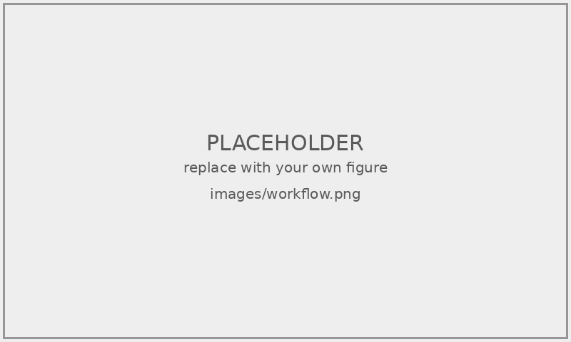

<!-- ============================================================ -->
<!-- 國科會制式外封（第一頁，無頁碼） -->
<!-- ============================================================ -->

\begin{titlepage}
\begin{center}

\vspace*{1.5cm}

{\fontsize{20pt}{28pt}\selectfont\bfseries 國科會補助}

\vspace{0.6cm}

{\fontsize{20pt}{28pt}\selectfont\bfseries 大專學生研究計畫研究成果報告}

\vspace{2cm}

{\fontsize{14pt}{20pt}\selectfont ＊＊＊＊＊＊＊＊＊＊＊＊＊＊＊＊}

\vspace{0.3cm}

{\fontsize{14pt}{20pt}\selectfont 計\ 畫\ 名\ 稱：\ProjectTitleZh}

\vspace{0.3cm}

{\fontsize{14pt}{20pt}\selectfont ＊＊＊＊＊＊＊＊＊＊＊＊＊＊＊＊}

\vspace{1.8cm}

\begin{flushleft}
\hspace{2cm}{\fontsize{14pt}{22pt}\selectfont 執行計畫學生：\StudentName}\\[4pt]
\hspace{2cm}{\fontsize{14pt}{22pt}\selectfont 學生計畫編號：\ProjectId}\\[4pt]
\hspace{2cm}{\fontsize{14pt}{22pt}\selectfont 研\ 究\ 期\ 間：\PeriodFrom 至\PeriodTo 止，\PeriodMonths}\\[4pt]
\hspace{2cm}{\fontsize{14pt}{22pt}\selectfont 指\ 導\ 教\ 授：\AdvisorName}
\end{flushleft}

\vfill

\begin{flushright}
{\fontsize{14pt}{22pt}\selectfont 處\ 理\ 方\ 式：\HandlingMethod}\hspace{1.5cm}\mbox{}\\[4pt]
{\fontsize{14pt}{22pt}\selectfont 執\ 行\ 單\ 位：\Affiliation}\hspace{1.5cm}\mbox{}\\[4pt]
{\fontsize{14pt}{22pt}\selectfont 中\ 華\ 民\ 國\ \ROCYear\ 年\ \ROCMonth\ 月\ \ROCDay\ 日}\hspace{1.5cm}\mbox{}
\end{flushright}

\vspace{1cm}

\end{center}
\end{titlepage}

<!-- ============================================================ -->
<!-- 內封（第二頁，無頁碼） -->
<!-- ============================================================ -->

\begin{titlepage}
\begin{center}

\vspace*{3cm}

{\fontsize{16pt}{24pt}\selectfont\bfseries \ProjectType}

\vspace{2.5cm}

{\fontsize{22pt}{30pt}\selectfont\bfseries \ProjectTitleZh}

\vspace{1cm}

{\fontsize{14pt}{20pt}\selectfont \ProjectId}

\vspace{4cm}

{\fontsize{14pt}{20pt}\selectfont 指導老師：\AdvisorName\ \ 老師}

\vspace{1cm}

{\fontsize{14pt}{20pt}\selectfont 專題學生：\StudentName}

\vfill

{\fontsize{14pt}{20pt}\selectfont 中\ 華\ 民\ 國\ \ROCYear\ 年\ \ROCMonth\ 月}

\vspace{1cm}

\end{center}
\end{titlepage}

<!-- ============================================================ -->
<!-- 摘要（羅馬數字頁碼 I, II, III ...） -->
<!-- 國科會大專生報告通常僅有中文摘要 -->
<!-- ============================================================ -->

\pagenumbering{Roman}
\pagestyle{frontmatter}

\begin{center}
{\Large\bfseries 摘要}
\end{center}

<請在此撰寫中文摘要，建議 500–800 字。摘要應包含：研究背景與動機、研究問題、所提方法、實驗結果與結論。>

\vspace{0.5cm}

\noindent\textbf{關鍵詞：<關鍵字1>、<關鍵字2>、<關鍵字3>、<關鍵字4>、<關鍵字5>}

\newpage

<!-- ============================================================ -->
<!-- 目錄 -->
<!-- ============================================================ -->

\tableofcontents

\newpage

<!-- ============================================================ -->
<!-- 圖目錄 -->
<!-- ============================================================ -->

\listoffigures

\newpage

<!-- ============================================================ -->
<!-- 表目錄 -->
<!-- ============================================================ -->

\listoftables

\newpage

<!-- ============================================================ -->
<!-- 正文開始（阿拉伯數字頁碼） -->
<!-- ============================================================ -->

\pagenumbering{arabic}
\pagestyle{mainmatter}

# 緒論 {#sec:intro}

## 研究背景 {#sec:intro-background}

<請在此撰寫研究背景。可引用文獻：[@example-conference]。>

## 研究動機 {#sec:intro-motivation}

<請說明研究動機與痛點觀察。>

## 研究目的 {#sec:intro-purpose}

<請條列本計畫的具體研究目的。>

## 研究範圍 {#sec:intro-scope}

<請界定研究對象、設備、材料與資料規模。>

## 研究流程 {#sec:intro-workflow}

<說明本計畫整體執行流程。可插入流程圖：>

<!--
範例：
{#fig:workflow width=80%}
-->

# 文獻回顧 {#sec:literature}

## <主題一> {#sec:literature-topic1}

<請回顧第一個相關主題。>

## <主題二> {#sec:literature-topic2}

<請回顧第二個相關主題。>

# 研究方法 {#sec:method}

## 研究架構 {#sec:method-architecture}

<請說明整體研究架構。可插入系統架構圖：>

<!--
範例（精確控制圖片大小）：
\begin{figure}[!htbp]
\centering
\includegraphics[width=0.8\textwidth]{images/system.png}
\caption{系統架構圖}
\label{fig:system}
\end{figure}
-->

## 實驗設備 {#sec:method-equipment}

<請說明設備規格。可用表格呈現：>

<!--
範例：
\begin{table}[htbp]
\centering
\caption{設備技術規格}
\label{tab:equipment}
\small
\begin{tabular}{ll}
\hline
\textbf{規格項目} & \textbf{規格值} \\
\hline
最大尺寸 & 256 × 256 × 256 mm \\
最高速度 & 500 mm/s \\
\hline
\end{tabular}
\end{table}
-->

## 方法細節 {#sec:method-details}

<請說明方法的關鍵技術細節。如有公式：>

\begin{equation}
y = f(x; \theta) + \epsilon
\label{eq:example}
\end{equation}

公式 \ref{eq:example} 為示範公式。

# 實驗結果與分析 {#sec:results}

## 資料統計 {#sec:results-data}

<請呈現資料統計。>

## 主要結果 {#sec:results-main}

<請呈現主要實驗結果。>

## 討論 {#sec:results-discussion}

<請討論結果背後的意義與限制。>

# 結論與建議 {#sec:conclusion}

## 結論 {#sec:conclusion-summary}

<請總結本計畫主要研究成果。>

## 建議 {#sec:conclusion-future}

<請提出對後續研究的具體建議。>

<!-- ============================================================ -->
<!-- 參考文獻 -->
<!-- ============================================================ -->

\newpage
\printbibliography[title=參考文獻]

<!-- ============================================================ -->
<!-- 附錄（如有需要） -->
<!-- 國科會大專生報告常見附錄：實驗照片紀錄、設備設定截圖、原始數據 -->
<!-- ============================================================ -->

<!--
附錄章節範例（如不需要附錄請刪除以下整段）：

\newpage
\appendix
\renewcommand{\thesection}{附錄\ \Roman{section}}
\renewcommand{\thefigure}{附\arabic{section}-\arabic{figure}}
\renewcommand{\thetable}{附\arabic{section}-\arabic{table}}
\titleformat{\section}
  {\centering\Large\bfseries}
  {附錄\ \Roman{section}}{1em}{}

# 第一份附錄標題 {#sec:appendix-one}

<附錄內容>

# 第二份附錄標題 {#sec:appendix-two}

<附錄內容>
-->
