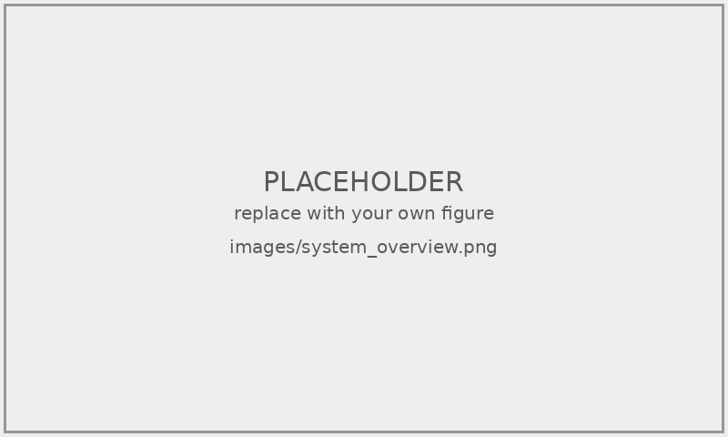

<!-- ============================================================ -->
<!-- 封面頁（無頁碼） -->
<!-- ============================================================ -->

\begin{titlepage}
\begin{center}

\vspace*{1cm}

{\fontsize{24pt}{28pt}\selectfont\bfseries \Spaced[1em]{\UniversityZh}}

\vspace{1.2cm}

{\fontsize{18pt}{24pt}\selectfont \Spaced[0.5em]{\College\Department}}

\vspace{0.6cm}

{\fontsize{18pt}{24pt}\selectfont \Spaced[0.5em]{\Degree}}

\vspace{2.5cm}

{\fontsize{18pt}{24pt}\selectfont\bfseries \ThesisTitleZh}

\vspace{0.5cm}

{\fontsize{14pt}{18pt}\selectfont \ThesisTitleEn}

\vspace{4cm}

{\fontsize{14pt}{18pt}\selectfont \Spaced[0.3em]{研究生：}\StudentName}

\vspace{0.3cm}

{\fontsize{14pt}{18pt}\selectfont \Spaced[0.3em]{指導教授：}\AdvisorName}

\vspace{2cm}

{\fontsize{14pt}{18pt}\selectfont \Spaced[0.3em]{中華民國\ROCYear 年\ROCMonth 月\ROCDay 日}}

\end{center}
\end{titlepage}

<!-- ============================================================ -->
<!-- 摘要（羅馬數字頁碼 i, ii, iii ...） -->
<!-- ============================================================ -->

\pagenumbering{roman}
\pagestyle{frontmatter}

\begin{center}
{\Large\bfseries 摘要}
\end{center}

<請在此撰寫中文摘要，建議 500–800 字。摘要應包含：研究背景與動機、研究問題、所提方法、實驗結果與結論。>

\vspace{1cm}

\noindent\textbf{關鍵字：<關鍵字1>、<關鍵字2>、<關鍵字3>、<關鍵字4>、<關鍵字5>}

\newpage

<!-- ============================================================ -->
<!-- Abstract（英文摘要） -->
<!-- ============================================================ -->

\begin{center}
{\Large\bfseries Abstract}
\end{center}

<Write the English abstract here, typically 300–500 words. Should mirror the Chinese abstract in content.>

\vspace{1cm}

\noindent\textbf{Keywords: <Keyword1>, <Keyword2>, <Keyword3>, <Keyword4>, <Keyword5>}

\newpage

<!-- ============================================================ -->
<!-- 致謝 -->
<!-- ============================================================ -->

\begin{center}
{\Large\bfseries 致謝}
\end{center}

<請在此撰寫致謝詞。建議依序感謝：指導教授、口試委員、實驗室同學、家人。>

\vspace{0.5cm}
由衷感謝

\vspace{2cm}

\begin{flushright}
{\StudentName}　謹誌

中華民國 {\ROCYear} 年 {\ROCMonth} 月 {\ROCDay} 日
\end{flushright}

\newpage

<!-- ============================================================ -->
<!-- 目錄 -->
<!-- ============================================================ -->

\tableofcontents

\newpage

<!-- ============================================================ -->
<!-- 圖目錄 -->
<!-- ============================================================ -->

\listoffigures

\newpage

<!-- ============================================================ -->
<!-- 表目錄 -->
<!-- ============================================================ -->

\listoftables

\newpage

<!-- ============================================================ -->
<!-- 正文開始（阿拉伯數字頁碼） -->
<!-- ============================================================ -->

\pagenumbering{arabic}
\pagestyle{mainmatter}

# 緒論 {#sec:intro}

## 研究背景 {#sec:intro-background}

<請在此撰寫研究背景。簡述問題領域的現況、重要性，以及為什麼這個題目值得研究。可引用文獻：[@example-key]。>

## 研究動機與目的 {#sec:intro-motivation}

<請說明研究動機（觀察到什麼問題、現有方法的不足）與研究目的（你想解決什麼、達成什麼）。>

## 研究貢獻 {#sec:intro-contribution}

<請條列本論文的主要貢獻，建議 2-4 點。>

1. **<貢獻一>**：<簡述貢獻內容>
2. **<貢獻二>**：<簡述貢獻內容>
3. **<貢獻三>**：<簡述貢獻內容>

## 論文架構 {#sec:intro-structure}

<說明本論文後續各章節的安排。CCU 慣例：章用中文數字，節用阿拉伯。範例：>

本論文共分為五章。第\ref{sec:literature}章回顧相關文獻；第\ref{sec:method}章說明所提方法；第\ref{sec:results}章呈現實驗結果與討論；第\ref{sec:conclusion}章總結本研究並提出未來工作方向。

# 文獻探討 {#sec:literature}

## <第一個主題> {#sec:literature-topic1}

<請在此回顧該主題的相關研究。引用文獻範例：[@vaswani2017attention; @he2016resnet]。>

## <第二個主題> {#sec:literature-topic2}

<請在此回顧另一個主題的相關研究。>

## 小結 {#sec:literature-summary}

<簡述文獻回顧的整體發現，以及本研究與既有研究的差異。>

# 研究方法 {#sec:method}

## 系統概述 {#sec:method-overview}

<請說明你的方法整體架構。可插入系統流程圖：>

<!--
範例：插入單張圖片
{#fig:system-overview width=80%}

範例：插入單張大圖（精確控制尺寸）
\begin{figure}[!htbp]
\centering
\includegraphics[width=1\textwidth,height=0.9\textheight,keepaspectratio]{images/system_overview.png}
\caption{系統架構流程}
\label{fig:system-overview}
\end{figure}
-->

如圖 \ref{fig:system-overview} 所示，本研究的整體架構分為三個主要模組。

## <方法一> {#sec:method-approach1}

<請說明第一個方法元件的細節。可插入公式：>

式 \eqref{eq:example-formula} 定義了核心運算：

\begin{equation}
y = f(x; \theta) + \epsilon
\label{eq:example-formula}
\end{equation}

## <方法二> {#sec:method-approach2}

<請說明第二個方法元件。>

# 實驗結果與討論 {#sec:results}

## 實驗設定 {#sec:results-setup}

<請說明：資料集、評估指標、實驗環境、超參數設定。可用表格呈現：>

<!--
範例 LaTeX 表格：
\begin{table}[htbp]
\centering
\caption{實驗超參數設定}
\label{tab:hyperparameters}
\small
\begin{tabular}{ll}
\hline
\textbf{超參數} & \textbf{值} \\
\hline
學習率 (Learning Rate) & 1e-4 \\
批次大小 (Batch Size)  & 32 \\
訓練週期 (Epochs)      & 100 \\
最佳化器 (Optimizer)   & AdamW \\
\hline
\end{tabular}
\end{table}
-->

實驗超參數設定如表 \ref{tab:hyperparameters} 所示。

## 主要結果 {#sec:results-main}

<請呈現主要實驗結果。建議搭配表格與圖表。>

## 消融研究 {#sec:results-ablation}

<請說明各元件對性能的貢獻。>

## 討論 {#sec:results-discussion}

<請分析結果背後的意義、與現有方法的比較、模型的限制等。>

# 結論與未來工作 {#sec:conclusion}

## 結論 {#sec:conclusion-summary}

<請總結本論文的研究成果與貢獻。>

## 未來工作 {#sec:conclusion-future}

<請說明本研究可能的延伸方向。>

<!-- ============================================================ -->
<!-- 參考文獻（Pandoc + biblatex 自動產生） -->
<!-- ============================================================ -->

\newpage
\printbibliography[title=參考文獻]
